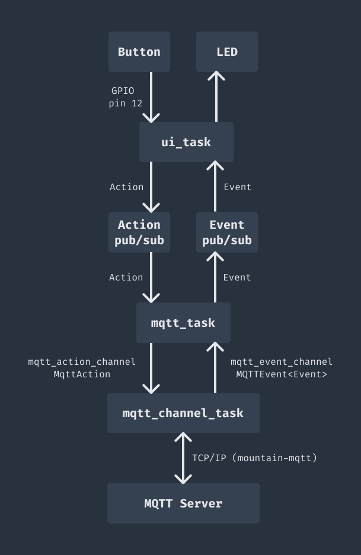

# embassy-example-rp2040w

A simple MQTT example to run on an Raspberry Pi Pico W (or other compatible RP2040 board with wireless)

## Running the example

You will need the wireless-equipped version of a [Raspberry Pi Pico](https://www.raspberrypi.com/products/raspberry-pi-pico/) board. The example should also be relatively simple to adapt to the [Raspberry Pi Pico 2](https://www.raspberrypi.com/products/raspberry-pi-pico-2/).

Before running the example, make sure your Pico board is connected to power, and connect a [Raspberry Pi Debug Probe](https://www.raspberrypi.com/documentation/microcontrollers/debug-probe.html) to the Pico debug port and via USB to your development PC. The example also reads a button connected to GPIO pin 12 - this isn't required, but if you want to try it then connect a push-to-close momentary switch between GPIO pin 12 and ground (or just use a wire connected to GPIO pin 12 that you can connect and disconnect from ground).

The example will attempt to connect to a WiFi network, and then to an MQTT server. The example has been tested with a Mosquitto server running in Docker - note that the example does not use an MQTT username or password, so your server will need to be configured to accept unauthenticated connections.

You will need to specify the WiFi SSID/password and MQTT server host/port using environment variables when building and flashing the example. Run the following from the `embassy-example-rp2040w` directory, making sure to adapt each environment variable above to your WiFi and MQTT server:

```bash
MQTT_HOST='192.168.0.201' MQTT_PORT='1883' WIFI_NETWORK='YOUR_SSID' WIFI_PASSWORD='YOUR_WIFI_PASS' cargo run --release
```

If you have trouble running the example after changing the environment variables, try running `cargo clean` and then run the command above again.

If this works you will see the example build, and `probe-rs` (you may need to [install it](https://probe.rs/docs/getting-started/installation/)) will be used to flash the Pico and start running - you should then see output showing the WiFi and MQTT connection process:

```bash
❯ MQTT_HOST='192.168.0.201' MQTT_PORT='1883' WIFI_NETWORK='mint' WIFI_PASSWORD='PXgu17wAIcPM' cargo run --release
   Compiling embassy-example-rp2040w v0.1.0 (/Users/rebeam/Documents/dev/mountain-mqtt/embassy-example-rp2040w)
    Finished `release` profile [optimized + debuginfo] target(s) in 5.00s
     Running `probe-rs run --chip RP2040 target/thumbv6m-none-eabi/release/embassy-example-rp2040w`
      Erasing ✔ 100% [####################] 372.00 KiB @  84.56 KiB/s (took 4s)
  Programming ✔ 100% [####################] 372.00 KiB @  34.82 KiB/s (took 11s)                                                                                                                                                                                                                                                                                                                              Finished in 15.09s
0.002353 INFO  Hello World!
└─ embassy_example_rp2040w::____embassy_main_task::{async_fn#0} @ src/main.rs:72
...
```

Once the board has connected, check for activity on your server (for example using [MQTT Explorer](https://mqtt-explorer.com)). You should see a "presence" message:

```text
embassy-example-rp2040w-presence = true
```

If you have connected a button, you can press and release it to see messages on `embassy-example-rp2040w-button` - this should be `true` when the button is held down, and `false` when it is released.

Finally, you can send a message to `embassy-example-rp2040w-led` with `true` to turn on the on-board LED on the Pico board, and `false` to turn it off.

## How the example works

The following explanation goes into a fair amount of detail - hopefully the overall operation of the example will be fairly clear from the code, the overall flow of data is as follows:



The example uses the `mqtt_manager` module from the `mountain-mqtt-embassy` crate, which in turn uses `mountain-mqtt` as a library to send and receive MQTT packets.

`mqtt_manager` uses channels to send "action" messages to the MQTT server, and receive "event" messages from the server. Note the terminology here is specific to `mqtt_manager` - both "actions" and "events" are just messages, we just use these terms to keep track of which direction the messages are travelling between the server and client.

First, we need to establish what information we want to send and receive - the `action` crate contains a simple enum:

```rust
pub enum Action {
    Button(bool),
}
```

This contains only one type of action, `Button`, which has a boolean that is `true` when a switch connected to the board is pressed, and `false` when it's released.

Now we need to know how to send this to the MQTT server - to do this, we implement the `MqttOperations` for `Action` - see `action.rs` for details, but essentially we implement the `perform` method, where we are given a `Client` instance and some other information, and we can use this `Client` to publish messages to the MQTT server. Note that we don't have to just publish one message - we could send multiple, or perform other actions like subscribing to topics.

In the case of `Action`, we handle the `Button` variant by sending a message to the topic `"embassy-example-rp2040w-button"` containing the `bool` value encoded as JSON.

Next, we need to represent events - messages coming from the server to the client. The `event` crate contains another simple enum:

```rust
pub enum Event {
    Led(bool),
}
```

This is very similar to our action - we just have an `Led` variant, containing a `bool` value that is `true` to turn on the light on our board, `false` to turn it off.

For events, we need to implement the `FromApplicationMessage` trait, this allows us to convert an `ApplicationMessage` to an `Event`. Each `ApplicationMessage` contains the raw contents of a message from the MQTT server, including the topic and payload - in this case we just look for the expected topic for LED messages, `"embassy-example-rp2040w-led"`, and then parse the payload as a boolean. If we can't parse the message, we must return a suitable `EventHandlerError`.

So now we have an `Action` type representing messages published by the client to the server, an `Event` type for messages we expect to receive from the server (for topics we will subscribe to), and trait implementations for converting between those types and MQTT operations or data.

Next, we need to set up tasks to manage sending and receiving messages. This is done in the `example_mqtt_manager` module.

First, we will extend our actions a little - for the example, we will actually do a little more than the minimum required to implement MQTT communication. We've set up an `Action` type, but this type deliberately only contains actions that are directly meaningful to our example. We've missed out MQTT "housekeeping" tasks like subscribing to topics. We add those in by creating a new `MqttAction` type:

```rust
pub enum MqttAction {
    AnnounceAndSubscribe { connection_id: ConnectionId },
    Action(Action),
}
```

This has two variants:

- Firstly, a "housekeeping" action, which represents announcing that we've started up (by publishing a message), and subscribing to topics we are interested in for events (in this case just the LED topic)
- Secondly, a variant that just wraps our existing `Action` type. This means we can add new `Actions` and have them automatically be supported by `MqttAction`.

> Note: If we wanted to, we could just put `AnnounceAndSubscribe` and our `Button` variant from `Action` directly into one single enum ( we could call it `UniversalAction`), and just use that. However then we'd be mixing together two layers - actions that are part of our actual purpose (like `Button`), and ones that only exist to handle MQTT details, like `AnnounceAndSubscribe`. Let's say that later on we want to provide a USB interface - at that point, we would want to send `Button` actions over the USB connection, but `AnnounceAndSubscribe` would be meaningless. Having a separate `Action` type means we can use that for things like the USB interface, and skip things that only matter for MQTT.

As we did for `Action`, we implement `MqttOperations` for `MqttAction` - we handle `AnnounceAndSubscribe` by publishing our "presence" message to let everyone know we're online, and subscribing to the LED topic so we can receive application messages that will become `Event::Led`. For `Action(Action)` we can just call straight through to `Action`'s implementation of `MqttOperations`.

There's an interesting feature in how we handle `AnnounceAndSubscribe`. The `mqtt_manager` task will handle reconnecting to the MQTT server if the connection is closed or becomes non-responsive. Whenever a new connection is made, it's assigned a new `ConnectionId`, and this is passed to `MqttOperations::perform`. When handling `AnnounceAndSubscribe`, we only want to subscribe to topics once per connection - therefore `AnnounceAndSubscribe` has a `connection_id` field, and we can use this to make sure we only subscribe if the expected connection is still in place. We'll see later that a new `AnnounceAndSubscribe` action is created each time a new connection is made.

Next, we need to create the task that will use `mqtt_manager` to handle actions and events. This is just boilerplate - `mqtt_manager::run` is a function that will do everything we need, but it is generic to allow us to specify various parameters, so can't be used directly as an embassy task. We just wrap this in a new non-generic function that can be used as a task:

```rust
#[embassy_executor::task]
async fn mqtt_channel_task(
    stack: Stack<'static>,
    uid: &'static str,
    event_sender: Sender<'static, NoopRawMutex, MqttEvent<Event>, 32>,
    action_receiver: Receiver<'static, NoopRawMutex, MqttAction, 32>,
    host: Ipv4Address,
    port: u16,
) -> ! {
    let settings = Settings::new(host, port);
    let connection_settings = ConnectionSettings::unauthenticated(uid);

    mqtt_manager::run::<MqttAction, Event, 16, 4096, 32>(
        stack,
        connection_settings,
        settings,
        event_sender,
        action_receiver,
    )
    .await;
}
```

First we create settings and connection settings, then we call `mqtt_manager::run` specifying that it should handle up to 16 properties per MQTT packet, use a 4096 byte buffer for messages, and allow for 32 actions/events in the Sender/Receiver queues. We also provide our action and event types.

Now we have a task we can use for MQTT comms - to use this we just need to set up our embassy channels for actions and events, and start the task:

```rust
    let mqtt_action_channel = EVENT_CHANNEL.init(Channel::<NoopRawMutex, MqttAction, 32>::new());
    let mqtt_event_channel =
        ACTION_CHANNEL.init(Channel::<NoopRawMutex, MqttEvent<Event>, 32>::new());

    unwrap!(spawner.spawn(mqtt_channel_task(
        stack,
        uid,
        mqtt_event_channel.sender(),
        mqtt_action_channel.receiver(),
        host,
        port
    )));
```

Note that we pass:

- `mqtt_event_channel.sender()` so that the task can send events received from the MQTT server to the channel, and
- `mqtt_action_channel.receiver()` so that the task can receive actions from the channel, to send to the MQTT server.

We now just have to use the other ends of the channels to send actions and receive events, and these will be connected to the MQTT server.

Just to make things a little more flexible (and a bit more complicated!) the example uses a pub/sub approach to this, so thatwe can produce actions and handle events using multiple tasks. This can be seen in `example_mqtt_manager`, where we set up an additional task to bridge our pubsub channels to our MQTT channels:

```rust
#[embassy_executor::task]
async fn mqtt_task(
    mut actions_in: ActionSub,
    actions_out: Sender<'static, NoopRawMutex, MqttAction, 32>,
    events_in: Receiver<'static, NoopRawMutex, MqttEvent<Event>, 32>,
    events_out: EventPub,
) -> ! {
    loop {
        let next = select::select(actions_in.next_message_pure(), events_in.receive()).await;
        match next {
            Either::First(action) => {
                // Always leave space free for sending AnnounceAndSubscribe actions
                // in response to connecting - if we don't send these, we won't subscribe, and
                // the MQTT connection won't work as expected
                // If we have to drop outgoing actions, do so rather than blocking
                if actions_out.free_capacity() > 8 {
                    let _ = actions_out.try_send(MqttAction::Action(action));
                }
            }
            Either::Second(event) => match event {
                MqttEvent::ApplicationEvent {
                    connection_id: _,
                    event,
                } => {
                    events_out.publish_immediate(event);
                }
                MqttEvent::Connected { connection_id } => {
                    actions_out
                        .send(MqttAction::AnnounceAndSubscribe { connection_id })
                        .await
                }
                MqttEvent::ConnectionStable { .. } => info!("MQTT connection stable"),
                MqttEvent::Disconnected { .. } => info!("MQTT disconnected"),
                event => {
                    info!("{:?}", event);
                }
            },
        }
    }
}
```

This is where we can implement any MQTT specific logic - in this case we handle announcing and subscribing in response to making a new connection.

We can see that the `mqtt_task` accepts `actions_in` where we receive `Action`s from the pubsub, and `actions_out` where we send `MqttActions` to the MQTT task. Similarly, we have `events_in` where we receive `MqttEvent`s from the MQTT task, and `events_out` where we can publish the resulting `Event`s to the pubsub.

`MqttEvent` is new - this is what `mqtt_manager` uses to represent the important events that can occur as it communicates with an MQTT server - we can see above that the important events deal with connecting, disconnecting, and seeing that the connection is stable, and most importantly, receiving an application event.

The task is relatively simple - we just loop forever, grabbing the next available action or event and handling it.

When we receive an `Action` from the pubsub, we just wrap it in `MqttAction::Action` and send it through to MQTT. The wrinkle here is that we reserve some capacity in the channel for other purposes - in this case `MqttAction::AnnounceAndSubscribe`, which we need to send each time we make a new connection. So we'll effectively drop `Action`s when our channels are getting full, to ensure we can still handle responding to connections. Note that this logic is just an example - you're free to manage your channels however makes sense for the application.

When we receive an `MqttEvent` from the MQTT channel, we have a bit more work to do. If we get an `MqttEvent::ApplicationEvent`, this will contain an `Event` decoded from the application message (this is why we implemented `FromApplicationMessage` earlier), and so we can send it straight on to the pubsub channel via `events_out`. If we have `MqttEvent::Connected`, then the manager has just made a new connection - if all we did was publish messages, this wouldn't necessarily need to do anything, but in this case we want to subscribe to our LED topic, so we send an `MqttAction::AnnounceAndSubscribe` action. This will join the channel, and later when it is handled by `mqtt_manager` will cause the client to subscribe to the topic - as discussed above, we only want to subscribe once per connection, so we pass the `ConnectionId` as part of `MqttAction::AnnounceAndSubscribe`. As we saw above when we implement `MqttOperations` for `MqttAction` we can use this to check that the same connection is still in place - there's always a chance that the connection will have dropped and a new connection been made before the action is handled, and in this case we just skip doing anything, to avoid trying to subscribe in the wrong connection.

For other events, we just do some logging, but depending on the application these might need to be handled, for example `ConnectionStable` is triggered after the connection has been held for a time specified in `Settings.stabilisation_interval`.

Note that we could also maintain some state in `mqtt_task` if needed.

At this point, we have a setup where we can publish `Action`s to a pubsub channel and have them automatically relayed to MQTT, and we will receive `Event`s on another pubsub channel whenever a relevant message is received from the MQTT server.

The remaining code is not directly relevant to `mqtt_manager`, but just to cover the basics:

- `channels.rs` has types for the pubsub channels to reduce repetition.
- `main.rs`:
  - Reads the UID of the Pico processor to allow us to produce a unique client id
  - Starts up WiFi using DHCP
  - Creates our action and event pubsub channels
  - Starts a "UI" task that handles the button and led actions/events
  - Starts our MQTT tasks using `example_mqtt_manager::init`
- `ui.rs` contains a task that:
  - Polls GPIO pin 12 to detect when the button is pressed or released, and sends an `Action::Button` action
  - Checks for `Event::Led` events and turns the on-board LED on or off accordingly.

As described above, this is a nice advantage of separating into `Action` and `MqttAction` - the UI task only needs to handle `Action`s that relate to relevant things like pressing buttons, and not MQTT-specific implementation details. Similarly, we handle `MqttEvent` in our MQTT tasks, and we only need to deal with relevant `Event`s like LED commands in the UI task.
