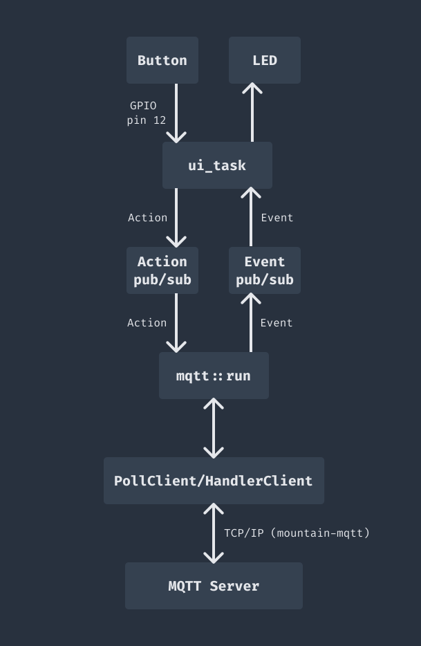

# embassy-example-rp2040w

A simple MQTT example to run on an Raspberry Pi Pico W (or other compatible RP2040 board with wireless)

## Running the example

You will need the wireless-equipped version of a [Raspberry Pi Pico](https://www.raspberrypi.com/products/raspberry-pi-pico/) board. The example should also be relatively simple to adapt to the [Raspberry Pi Pico 2](https://www.raspberrypi.com/products/raspberry-pi-pico-2/).

Before running the example, make sure your Pico board is connected to power, and connect a [Raspberry Pi Debug Probe](https://www.raspberrypi.com/documentation/microcontrollers/debug-probe.html) to the Pico debug port and via USB to your development PC. You may also need to you may need to [install probe-rs](https://probe.rs/docs/getting-started/installation/). A debug probe is strongly recommended, but you can also [try this approach to run without one](https://embassy.dev/book/#_how_to_deploy_to_rp2040_or_rp235x_without_a_debugging_probe).

The example also reads a button connected to GPIO pin 12 - this isn't required, but if you want to try it then connect a push-to-close momentary switch between GPIO pin 12 and ground (or just use a wire connected to GPIO pin 12 that you can connect and disconnect from ground).

The example will attempt to connect to a WiFi network, and then to an MQTT server. The example has been tested with a Mosquitto server running in Docker - note that the example does not use an MQTT username or password, so your server will need to be configured to accept unauthenticated connections.

You will need to specify the WiFi SSID/password and MQTT server host/port using environment variables when building and flashing the example. Run the following from the `embassy-poll-example-rp2040w` directory, making sure to adapt each environment variable above to your WiFi and MQTT server:

```bash
MQTT_HOST='192.168.0.201' MQTT_PORT='1883' WIFI_NETWORK='YOUR_SSID' WIFI_PASSWORD='YOUR_WIFI_PASS' cargo run --release
```

If you have trouble running the example after changing the environment variables, try running `cargo clean` and then run the command above again.

If this works you will see the example build, and `probe-rs` will be used to flash the Pico and start running - you should then see output showing the WiFi and MQTT connection process:

```bash
❯ MQTT_HOST='192.168.0.201' MQTT_PORT='1883' WIFI_NETWORK='mint' WIFI_PASSWORD='PXgu17wAIcPM' cargo run --release
   Compiling embassy-poll-example-rp2040w v0.1.0 (/Users/rebeam/Documents/dev/mountain-mqtt/embassy-poll-example-rp2040w)
    Finished `release` profile [optimized + debuginfo] target(s) in 5.00s
     Running `probe-rs run --chip RP2040 target/thumbv6m-none-eabi/release/embassy-poll-example-rp2040w`
      Erasing ✔ 100% [####################] 372.00 KiB @  84.56 KiB/s (took 4s)
  Programming ✔ 100% [####################] 372.00 KiB @  34.82 KiB/s (took 11s)                                                                                                                                                                                                                                                                                                                              Finished in 15.09s
0.002353 INFO  Hello World!
└─ embassy_poll_example_rp2040w::____embassy_main_task::{async_fn#0} @ src/main.rs:72
...
```

Once the board has connected, check for activity on your server (for example using [MQTT Explorer](https://mqtt-explorer.com)). You should see a "presence" message:

```text
embassy-poll-example-rp2040w-presence = true
```

If you have connected a button, you can press and release it to see messages on `embassy-poll-example-rp2040w-button` - this should be `true` when the button is held down, and `false` when it is released.

Finally, you can send a message to `embassy-poll-example-rp2040w-led` with `true` to turn on the on-board LED on the Pico board, and `false` to turn it off.

## How the example works

The following explanation goes into a fair amount of detail - hopefully the overall operation of the example will be fairly clear from the code, the overall flow of data is as follows:



The example uses `PollClient` and `HandlerClient` from the `mountain-mqtt-embassy` crate, which in turn use `mountain-mqtt` as a library to send and receive MQTT packets.

We will use "actions" to refer to message sent to the MQTT server (for example when a button is pressed on the device), and "events" to refer to messages from the server (for example when we want to turn an LED on the device on or off). Note the terminology here is specific to this project - both "actions" and "events" are just messages, we just use these terms to keep track of which direction the messages are travelling between the server and client.

First, we need to establish what information we want to send and receive - the `action` crate contains a simple enum:

```rust
pub enum Action {
    Button(bool),
}
```

This contains only one type of action, `Button`, which has a boolean that is `true` when a switch connected to the board is pressed, and `false` when it's released.

Next, we need to represent events - messages coming from the server to the client. The `event` crate contains another simple enum:

```rust
pub enum Event {
    Led(bool),
}
```

This is very similar to our action - we just have an `Led` variant, containing a `bool` value that is `true` to turn on the light on our board, `false` to turn it off.

For events, we implement the `FromApplicationMessage` trait, this allows us to convert an `ApplicationMessage` to an `Event`. Each `ApplicationMessage` contains the raw contents of a published message from the MQTT server, including the topic and payload. In this case we just look for the expected topic for LED messages, `"embassy-poll-example-rp2040w-led"`, and then parse the payload as a boolean. If we can't parse the message, we must return a suitable `EventHandlerError`.

So now we have an `Action` type representing messages published by the client to the server, an `Event` type for messages we expect to receive from the server (for topics we will subscribe to).

Next, we need to set up a task to manage sending and receiving messages. We have two implementations of this:

- The `mqtt` module uses `HandlerClient` and shows the simplest approach, where we use a `SyncEventHandler` to accept messages from the server. This is the best method to use unless you find you can't provide a handler that does everything you need to do.
- The `mqtt_poll` module uses `PollClient` - this allows more flexibility, but requires more code since we need to handle the process of waiting for expected responses from the server.

In `main.rs` you can see there's a line `let handler = true;` - this selects the `HandlerClient` operation, change the variable to false to run the `PollClient` version.

In both cases, we pass:

- `settings` - these define the host and port for the MQTT server,
- the wifi `stack` for comms,
- a `uid_handle` with the unique id produced from the microcontroller's embedded id (we'll use this to produce the MQTT client id),
- `event_pub_mqtt` so that the task can send events received from the MQTT server to the channel, and
- `action_sub_mqtt` so that the task can receive actions from the channel, to send to the MQTT server.

This gives us something like:

```rust
    unwrap!(spawner.spawn(mqtt::run(
        settings,
        stack,
        uid_handle,
        event_pub_mqtt,
        action_sub_mqtt
    )));
```

We now just have to use the other ends of the channels to send actions and receive events, and these will be connected to the MQTT server.

Both the `mqtt::run` and `mqtt_poll::run` tasks have the same overall structure - they consist of a loop that repeatedly calls `poll_client::run_mqtt_connection`. Each time this is called if makes a connection to the MQTT server and then runs until it is disconnected. We pass it the settings and stack so it can connect, then the important work happens in the `client_function` we also pass in.

The `client_function` is just an async fn that receives a `PollClient` (in the example we've defined a type alias `OurPollClient` just to avoid repeating the parameters multiple times) to use to talk to the MQTT server - we can do what we want with this client, but typically we will:

1. Use `client.connect` to request a connection. Note this happens after making a TCP socket connection - it sends an MQTT packet to request a connection, and waits for this to be acknowledged.
2. Subscribe to topics and/or publish any initial messages.
3. Receive incoming application messages that are published to subscribed topics, and publish additional application messages to the server.

A client function can either run indefinitely, only stopping if an error occurs (as in this example), or can end by calling `client.disconnect` and then exiting.

In `mqtt::run`, the `client_function` is a closure, which calls through to `client_function_with_channels`, passing the client, uid and our channel publisher and subcriber. The code here should be fairly self-explanatory, but there are a few points to note.

After calling `client.connect`, the `PollClient` is converted into a `HandlerClient` by calling `to_handler_client` with a `SyncEventHandler` implementation. This event handler just accepts `ClientReceivedEvent`s and processes them. Each `ClientReceivedEvent` represents something received by the client that may need to be handled - the main one here is `ApplicationMessage`, which contains a published message. There are also events for when the server acknowledges a message, or when an unexpected event occurs, such as the server granting a subscription at a quality of service lower than requested.

For the example, we provide a struct `QueueEventHandler` that just holds a publisher to our event channel, and an implementation of `SyncEventHandler` that decodes application messages to `Event`s and publishes them to this channel. Other events are just logged as `info!` or `warn!` as appropriate.

Once we have a `HandlerClient` it is used to subscribe to topics and publish a message to announce the device. Then we enter a loop that repeatedly selects between the next action from `action_sub` (this is just a stream of button presses in this case) and the next message from the server (using `client.receive()`). We respond to actions by publishing them to the MQTT topic using `client`. When messages are received they are handled by the `SyncEventHandler`, but we do still need to make sure to return any errors, this looks like `Either::Second(result) => result?`. This way if the event handler errors, the loop will exit - it will also exit for any communications errors when using `client`. Otherwise it can just keep running forever.

The remaining code is not directly relevant to `mqtt_manager`, but just to cover the basics:

- `channels.rs` has types for the pubsub channels to reduce repetition.
- `main.rs`:
  - Reads the UID of the Pico processor to allow us to produce a unique client id
  - Starts up WiFi using DHCP
  - Creates our action and event pubsub channels
  - Starts a "UI" task that handles the button and led actions/events
  - Starts our MQTT tasks using `mqtt::run`
- `ui.rs` contains a task that:
  - Polls GPIO pin 12 to detect when the button is pressed or released, and sends an `Action::Button` action
  - Checks for `Event::Led` events and turns the on-board LED on or off accordingly.

### Differences when using `PollClient`

The code in `mqtt_poll::run` is very similar to `mqtt::run`, however it doesn't convert the `PollClient` into a `HandlerClient`. As a result, rather than received messages being automatically passed to a `SyncEventHandler`, they must be manually received and processed. So for example where we could just call `HandlerClient::subscribe` and then continue with other code, when using `PollClient` we need the following:

```rust
    // Subscribe - this sends packet but does NOT wait for response - we will need to poll for packets
    client.subscribe(TOPIC_LED, QualityOfService::Qos1).await?;
    wait_for_responses(&mut client, event_pub).await?;
```

This is because after subscribing to a topic, we need to wait for the MQTT server to send an acknowledgment, and while waiting for this we may also receive other messages, e.g. published application messages. In this example, this is done by a `wait_for_responses` function:

```rust
pub async fn wait_for_responses(
    client: &mut Client<'_>,
    event_pub: &mut EventPub,
) -> Result<(), ClientError> {
    while client.waiting_for_responses() {
        let packet_bin = client.receive().await?;
        receive_event(client, packet_bin, event_pub).await?;
    }
    Ok(())
}
```

We loop until `client.waiting_for_responses()` returns false, indicating that there are no outstanding actions (like subscribing, or publishing a message with Quality of Service level 1). On each loop, we receive a packet from the client - this is a `PacketBin`, containing the raw, binary encoding of the MQTT packet. We need to process this binary packet, which is done in a `receive_event` function.

The important part of `receive_event` is to use the client to process the packet:

```rust
    let event: mountain_mqtt::client::ClientReceivedEvent<'_, 16> = client.process(&packet_bin).await?;
```

This updates the state of the client (e.g. to record when responses have been received), and returns a `ClientReceivedEvent`. This is the same type that is handled by the `SyncEventHandler` trait when using a `HandlerClient`. We can see that the remaining code in `receive_event` is very similar to that handler - it just converts application messages to `Event` and publishes them to our channel, and logs other events.

Looking through the rest of the code in `mqtt_poll` we can see that it's very similar to the `mqtt` code - we just need to call `wait_for_responses` after each `PollClient` method that sends packets (this is noted in the docs for the relevant client methods), and the final loop is a little different since it receives a `PacketBin` and then processes it, rather than just a plain call to `client.receive()`.

In general, if you can use `HandlerClient` it should be much simpler, but if it's difficult to produce a `SyncEventHandler` that works for the whole lifetime of an MQTT connection then `PollClient` allows you to adopt a more manual approach to handling incoming messages. It's worth noting that `HandlerClient` is just a simple wrapper around `PollClient` that uses a very similar approach to that shown in `mqtt_poll` to wait for responses and pass them to the handler.
